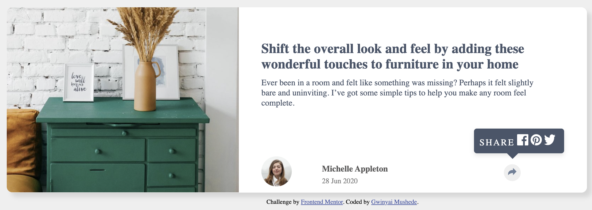

#  Article preview component solution

## Table of contents

- [Overview](#overview)
  - [The challenge](#the-challenge)
  - [Screenshot](#screenshot)
  - [Links](#links)
  - [Built with](#built-with)

## Overview

### The challenge

Users should be able to:

- See the social media share links when they click the share icon

### Screenshot

### Links

- Solution URL: [Github URL](https://github.com/gkuzivam/article-preview-component/tree/main)
- Live Site URL: [Live site URL](https://gkuzivam.github.io/article-preview-component/)

### Built with

- Semantic HTML5 markup
- CSS custom properties
- Flexbox
- CSS Grid
- JS
